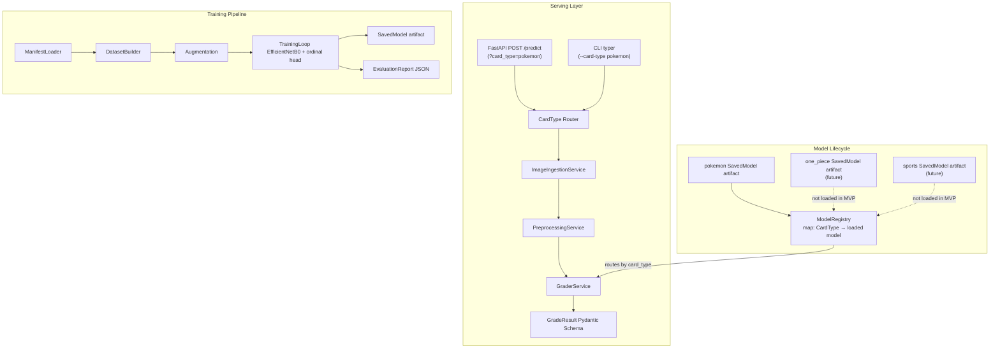

# Design Document: TCG Pre-Grader

## Overview

The TCG Pre-Grader is a CNN-based inference system that predicts PSA-scale grades (1–10) from trading card photos. It exposes predictions via a FastAPI REST endpoint and a CLI, backed by a training pipeline that treats grading as an ordinal regression problem rather than flat classification. The system is designed to support multiple card types (Pokemon as MVP, One Piece and sports cards as future additions) via a keyed `ModelRegistry` that routes inference requests to the correct model artifact.

**Key trade-off**: Ordinal regression preserves grade ordering (a PSA 8 is closer to a 9 than to a 1), which flat softmax classification ignores. The cost is a slightly more complex output head and loss function (CORN loss or cumulative link model), but the payoff is significantly better calibration on adjacent-grade errors — the metric that matters most for collectors.

---

## Architecture

The system is split into three top-level concerns: **Serving**, **Inference**, and **Training**. These are deliberately decoupled so the training pipeline can be iterated independently of the serving layer. The `ModelRegistry` acts as a router — it maps `card_type → loaded model` and is the single point of dispatch for all inference requests.



**Data flow (inference path)**:
1. Raw bytes + `card_type` arrive via HTTP multipart or CLI flag
2. `CardType` enum validates the requested type; unknown values are rejected at the boundary
3. `ModelRegistry` looks up the model for the requested `card_type`; raises `ModelNotFoundError` (→ HTTP 404) if not present
4. `ImageIngestionService` validates format, resolution, and batch size
5. `PreprocessingService` resizes, normalizes, applies perspective correction, and extracts four card region crops
6. `GraderService` runs the CNN on the full card + region crops, decodes ordinal outputs to integer grades and confidence
7. `GradeResult` is serialized to JSON and returned

**Design patterns used**:
- **Registry / Router** — `ModelRegistry` is a `dict[CardType, tf.saved_model]` loaded at startup; `GraderService` receives the registry and dispatches by `card_type`
- **Service Layer** — `ImageIngestionService`, `PreprocessingService`, `GraderService` are stateless classes with injected config; no business logic in route handlers
- **Repository pattern (light)** — `ManifestLoader` abstracts CSV parsing from the training loop
- **Strategy pattern** — backbone architecture is swappable via config without touching training loop logic

---

## Components and Interfaces

### 1. ImageIngestionService

Responsible for validating raw uploaded files before any processing occurs. Fails fast — no image touches the preprocessor if it fails validation.

```python
class ImageIngestionService:
    async def validate_and_load(
        self, files: list[UploadFile]
    ) -> list[tuple[str, bytes]]:
        """Returns list of (image_id, raw_bytes). Raises on any validation failure."""
```

Validation order:
1. Batch size ≤ 50 (checked before opening any file)
2. MIME type / magic bytes → JPEG or PNG
3. Decoded resolution ≥ 300×420

Raises `BatchSizeError`, `InvalidImageFormatError`, `ImageResolutionError` (all subclass `PregraderError`).

---

### 2. PreprocessingService

Stateless image transformation pipeline. Each step is a pure function to make unit testing straightforward.

```python
class PreprocessingService:
    def preprocess(self, raw_bytes: bytes) -> PreprocessedCard:
        """Returns full resized tensor + four region crop tensors."""
```

Steps (in order):
1. Decode bytes → PIL Image
2. Perspective correction via OpenCV contour detection (homography transform)
3. Resize to 224×312
4. Normalize to [0.0, 1.0]
5. Extract four `CardRegion` crops (centering, corners, edges, surface)

**Technical Debt flag**: Perspective correction using contour detection is brittle on low-contrast backgrounds or cards in sleeves. A production-grade approach would use a dedicated card-detection model (e.g., fine-tuned YOLO) as a preprocessing stage. For MVP, log a warning and pass through uncorrected if detection fails.

---

### 3. GraderService

Wraps the loaded TF SavedModel. Handles batching, ordinal decoding, and confidence extraction.

```python
class GraderService:
    def __init__(self, model_registry: ModelRegistry) -> None: ...

    async def predict(
        self, cards: list[PreprocessedCard]
    ) -> list[GradeResult]: ...
```

Ordinal decoding: The model outputs cumulative probabilities `P(Y ≤ k)` for k=1..9. The predicted grade is `argmax` of the probability mass `P(Y = k) = P(Y ≤ k) - P(Y ≤ k-1)`. Confidence is `max(P(Y = k))` over all k.

Subgrades are predicted by separate heads operating on the four region crops, using the same ordinal decoding.

---

### 4. ModelRegistry (Multi-Model Map)

Maps `CardType → loaded TF SavedModel`. Loaded once at application startup for all enabled card types. Exposes an `is_ready` flag (True only when all enabled types have loaded successfully) used by the health/readiness check.

```python
from enum import Enum

class CardType(str, Enum):
    pokemon = "pokemon"
    one_piece = "one_piece"
    sports = "sports"

class ModelRegistry:
    def __init__(self) -> None:
        self._models: dict[CardType, tf.saved_model] = {}

    def load(self, card_type: CardType, artifact_path: Path) -> None:
        """Load and register a model for the given card_type."""

    def get(self, card_type: CardType) -> tf.saved_model:
        """Returns the model for card_type. Raises ModelNotFoundError if not loaded."""
        if card_type not in self._models:
            raise ModelNotFoundError(
                f"No model loaded for card_type='{card_type.value}'. "
                f"Loaded types: {[t.value for t in self._models]}"
            )
        return self._models[card_type]

    @property
    def is_ready(self) -> bool:
        """True when at least one model is loaded and no load errors occurred."""
```

FastAPI lifespan event iterates `PregraderSettings.enabled_card_types` and calls `ModelRegistry.load()` for each. Route handlers call `registry.get(card_type)` — `ModelNotFoundError` maps to HTTP 404.

**Technical Debt flag**: The current design loads all enabled models into memory at startup — memory scales linearly with the number of enabled card types. At scale, prefer lazy loading (load on first request, evict on LRU) or a dedicated model server (TF Serving, Triton) per card type, with FastAPI workers calling over gRPC. For MVP with a single enabled type (`pokemon`), eager loading is acceptable.

---

### 5. FastAPI Application

Thin route layer — no business logic. Delegates entirely to services.

```
POST /predict          multipart/form-data + card_type (default: "pokemon") → list[GradeResult]
GET  /health           liveness probe
GET  /ready            readiness probe (checks ModelRegistry.is_ready)
```

Error mapping:
| Exception | HTTP Status |
|---|---|
| `BatchSizeError` | 422 |
| `InvalidImageFormatError` | 422 |
| `ImageResolutionError` | 422 |
| `ModelNotFoundError` | 404 |
| `InferenceError` | 500 |
| Model loading in progress | 503 |

---

### 6. CLI (Typer)

```bash
pregrader predict image1.jpg image2.png [--card-type pokemon] [--output results.json]
```

`--card-type` defaults to `"pokemon"`. If the requested type has no loaded model, prints a descriptive error to stderr and exits non-zero. Reuses `ImageIngestionService` and `GraderService` directly — no HTTP layer involved. Per-image errors are logged to stderr; processing continues for remaining images.

---

### 7. Training Pipeline Components

| Component | Responsibility |
|---|---|
| `ManifestLoader` | Parses CSV, validates schema, skips missing files with warning, halts on invalid grades |
| `DatasetBuilder` | Builds `tf.data.Dataset` with augmentation, applies train/val/test split |
| `AugmentationPipeline` | Random H-flip, ±20% brightness, ±5° rotation |
| `TrainingLoop` | Configurable backbone + ordinal head, logs metrics per epoch |
| `Evaluator` | MAE, ±1 accuracy, confusion matrix, saves JSON report |

---

## Data Models

All schemas use Pydantic v2. Validation is enforced at construction time — no raw dicts cross service boundaries.

```python
from enum import Enum
from pydantic import BaseModel, Field, field_validator
from pydantic_settings import BaseSettings

# --- Card Type Enum ---

class CardType(str, Enum):
    """Supported card game / sport categories. Only 'pokemon' has a loaded model in MVP."""
    pokemon = "pokemon"
    one_piece = "one_piece"   # future
    sports = "sports"          # future

# --- Output Schema ---

class Subgrades(BaseModel):
    centering: float = Field(ge=1.0, le=10.0)
    corners: float = Field(ge=1.0, le=10.0)
    edges: float = Field(ge=1.0, le=10.0)
    surface: float = Field(ge=1.0, le=10.0)

class GradeResult(BaseModel):
    image_id: str
    card_type: CardType
    overall_grade: int = Field(ge=1, le=10)
    subgrades: Subgrades
    confidence: float = Field(ge=0.0, le=1.0)

# --- Internal Preprocessing Schema ---

class CardRegion(BaseModel):
    name: str  # "centering" | "corners" | "edges" | "surface"
    tensor: list[list[list[float]]]  # H x W x C, normalized

class PreprocessedCard(BaseModel):
    image_id: str
    full_tensor: list[list[list[float]]]
    regions: list[CardRegion]

# --- Configuration ---

class PregraderSettings(BaseSettings):
    # Paths keyed by card type — only pokemon required for MVP
    pokemon_model_artifact_path: Path
    one_piece_model_artifact_path: Path | None = None
    sports_model_artifact_path: Path | None = None

    # Which card types to load at startup; drives ModelRegistry initialization
    enabled_card_types: list[CardType] = [CardType.pokemon]

    input_width: int = 224
    input_height: int = 312
    max_batch_size: int = 50
    api_host: str = "0.0.0.0"
    api_port: int = 8000
    log_level: str = "INFO"

    model_config = SettingsConfigDict(env_file=".env", env_file_encoding="utf-8")

# --- Training Manifest Row ---

class ManifestRow(BaseModel):
    image_path: Path
    overall_grade: int = Field(ge=1, le=10)
    centering: float = Field(ge=1.0, le=10.0)
    corners: float = Field(ge=1.0, le=10.0)
    edges: float = Field(ge=1.0, le=10.0)
    surface: float = Field(ge=1.0, le=10.0)

# --- Training Configuration ---

class TrainingConfig(BaseSettings):
    backbone: str = "EfficientNetB0"
    pretrained_weights: str = "imagenet"
    train_ratio: float = Field(default=0.70, gt=0, lt=1)
    val_ratio: float = Field(default=0.15, gt=0, lt=1)
    epochs: int = 50
    batch_size: int = 32
    learning_rate: float = 1e-4
    output_dir: Path = Path("artifacts/")
    log_dir: Path = Path("logs/")

    @field_validator("train_ratio", "val_ratio")
    @classmethod
    def ratios_must_sum_to_less_than_one(cls, v: float, info) -> float:
        # Full validation happens at the service level after both fields are set
        return v
```

**Note on `PreprocessedCard` tensors**: Using `list[list[list[float]]]` in Pydantic is convenient for schema definition but carries a serialization cost for large tensors. In the hot inference path, pass `np.ndarray` directly between services and only serialize at the API boundary. The Pydantic model serves as the contract definition, not the runtime carrier.

---

## Correctness Properties

*A property is a characteristic or behavior that should hold true across all valid executions of a system — essentially, a formal statement about what the system should do. Properties serve as the bridge between human-readable specifications and machine-verifiable correctness guarantees.*

---

### Property 1: Image format acceptance

*For any* byte sequence, the ingestion service should accept it if and only if its magic bytes identify it as a valid JPEG or PNG; all other byte sequences should be rejected with `InvalidImageFormatError`.

**Validates: Requirements 1.1, 1.4**

---

### Property 2: Resolution threshold enforcement

*For any* image with width < 300 or height < 420 pixels, the ingestion service should reject it with `ImageResolutionError`; for any image meeting or exceeding the minimum, it should be accepted.

**Validates: Requirements 1.2, 1.3**

---

### Property 3: Batch size boundary

*For any* batch of 1–50 valid images, the ingestion service should accept the batch; for any batch of 51 or more images, it should raise `BatchSizeError` before processing any image.

**Validates: Requirements 1.5, 1.6**

---

### Property 4: Preprocessor output shape invariant

*For any* valid input image (regardless of original dimensions), the preprocessed full tensor must have shape (312, 224, 3) and all pixel values must lie in [0.0, 1.0].

**Validates: Requirements 2.1, 2.2**

---

### Property 5: Card region extraction completeness

*For any* preprocessed card, the result must contain exactly four `CardRegion` objects with names `{"centering", "corners", "edges", "surface"}` — no more, no fewer.

**Validates: Requirements 2.5**

---

### Property 6: GradeResult output validity

*For any* valid preprocessed card passed to the grader, the returned `GradeResult` must satisfy: `overall_grade ∈ {1..10}` (integer), all four subgrades ∈ [1.0, 10.0] (float), and `confidence ∈ [0.0, 1.0]` (float).

**Validates: Requirements 3.1, 3.2, 3.3, 4.1, 4.4**

---

### Property 7: GradeResult serialization round-trip

*For any* valid `GradeResult` object, serializing it to JSON and then deserializing it must produce an object equal to the original.

**Validates: Requirements 4.2, 4.3**

---

### Property 8: Response cardinality

*For any* batch of N valid images submitted (via API or CLI), the system must return exactly N `GradeResult` objects in the response, in the same order as the inputs.

**Validates: Requirements 5.2, 6.2**

---

### Property 9: Registry load-once invariant per card type

*For any* enabled card type and any sequence of N prediction requests (N ≥ 1), the `ModelRegistry.load()` method must be called exactly once per card type, regardless of N.

**Validates: Requirements 5.6**

---

### Property 10: Batch partial-failure resilience

*For any* batch of N images where exactly one image causes an `InferenceError`, the system must return N-1 valid `GradeResult` objects for the remaining images and log the failure for the errored image.

**Validates: Requirements 6.5**

---

### Property 11: Manifest missing-file skip

*For any* manifest CSV containing M rows where K rows reference non-existent files, the loaded dataset must contain exactly M-K samples (the K missing-file rows are skipped with a warning, not an error).

**Validates: Requirements 7.2**

---

### Property 12: Dataset split partition invariant

*For any* dataset of N samples and any valid split ratios (train + val + test = 1.0), the three resulting splits must be pairwise disjoint, their union must equal the full dataset, and each split size must approximate the configured ratio within rounding tolerance.

**Validates: Requirements 7.5**

---

### Property 13: Augmentation non-determinism

*For any* input image, applying the augmentation pipeline twice must produce outputs that are not identical with high probability (i.e., the pipeline is not a no-op). Specifically, over 100 trials, at least 90% should produce a tensor different from the original.

**Validates: Requirements 7.4**

---

### Property 14: MAE metric correctness

*For any* list of (predicted_grade, actual_grade) pairs, the reported MAE must equal `mean(|predicted_i - actual_i|)` computed independently.

**Validates: Requirements 9.1**

---

### Property 15: Within-one accuracy metric correctness

*For any* list of (predicted_grade, actual_grade) pairs, the reported ±1 accuracy must equal `count(|predicted_i - actual_i| ≤ 1) / total` computed independently.

**Validates: Requirements 9.2**

---

### Property 16: Configuration validation completeness

*For any* `PregraderSettings` instantiation with a missing required field or an out-of-range value, Pydantic must raise a `ValidationError` before the application accepts requests; for any fully valid configuration, instantiation must succeed.

**Validates: Requirements 10.2, 10.3**

---

### Property 17: Unknown card type returns ModelNotFoundError / HTTP 404

*For any* `card_type` value not present as a key in the `ModelRegistry`, calling `registry.get(card_type)` must raise `ModelNotFoundError` with a message that includes the requested `card_type` value; when raised during an API request, the Serving Layer must return HTTP 404 with a structured error body.

**Validates: Requirements 3.5, 5.7**

---

## Error Handling

### Exception Hierarchy

All domain exceptions inherit from `PregraderError` to allow catch-all handling at the API boundary without swallowing unexpected errors.

```
PregraderError
├── ImageIngestionError
│   ├── InvalidImageFormatError
│   ├── ImageResolutionError
│   └── BatchSizeError
├── PreprocessingError
│   └── PerspectiveCorrectionWarning  (not an exception — logged only)
├── InferenceError
│   └── ModelNotFoundError(card_type: CardType)  # message includes card_type.value
├── ValidationError  (re-raised from Pydantic)
└── ConfigurationError
```

`ModelNotFoundError` carries the requested `card_type` in its message, e.g.: `"No model loaded for card_type='one_piece'. Loaded types: ['pokemon']"`. This surfaces cleanly in the HTTP 404 response body.

### Handling Strategy

| Layer | Strategy |
|---|---|
| Ingestion | Fail fast before any I/O. Validate batch size first (cheapest), then format (magic bytes), then resolution (requires decode). |
| Preprocessing | Perspective correction failure is non-fatal — log `WARNING` with image_id and continue. All other preprocessing failures raise `PreprocessingError`. |
| Inference | `ModelNotFoundError` maps to HTTP 404 — the requested card type is not loaded. Per-image `InferenceError` during batch processing is caught, logged with image_id, and skipped (CLI) or omitted from response with error entry (API). |
| API boundary | FastAPI exception handlers map domain exceptions to HTTP status codes. Unhandled exceptions return 500 with a structured `{"error": str, "type": str}` body — never a raw traceback. |
| Configuration | Pydantic `ValidationError` at startup is caught, re-raised as `ConfigurationError` with the missing field name, and logged before process exit. |

### Logging

Use Python `structlog` for structured JSON logging. Every log entry should include `image_id` where applicable. Log levels:
- `DEBUG`: tensor shapes, preprocessing step timings
- `INFO`: request received, prediction returned, model loaded
- `WARNING`: perspective correction failed, manifest row skipped
- `ERROR`: inference failed for image, unexpected exception
- `CRITICAL`: model not found, configuration invalid

**Technical Debt flag**: No distributed tracing (OpenTelemetry) is included in the MVP. Add trace IDs to log entries and instrument `GraderService.predict()` as a span when moving to production.

---

## Testing Strategy

### Dual Testing Approach

Unit tests and property-based tests are complementary — neither replaces the other.

- **Unit tests**: specific examples, error conditions, integration points, edge cases
- **Property tests**: universal invariants across randomly generated inputs

### Property-Based Testing

Use **Hypothesis** (Python) as the PBT library. Each property test must run a minimum of 100 examples (`@settings(max_examples=100)`).

Each test must be tagged with a comment referencing the design property:
```python
# Feature: tcg-pregrader, Property 7: GradeResult serialization round-trip
```

Property test targets (one test per property):

| Property | Test Description |
|---|---|
| P1: Image format acceptance | Generate random bytes with valid/invalid magic bytes; verify accept/reject |
| P2: Resolution threshold | Generate images of random dimensions; verify threshold behavior |
| P3: Batch size boundary | Generate batches of random size 1–100; verify accept ≤50, reject >50 |
| P4: Preprocessor output shape | Generate random valid images; verify output shape and pixel range |
| P5: Region extraction completeness | Generate random images; verify exactly 4 named regions returned |
| P6: GradeResult output validity | Generate random preprocessed cards (mocked model); verify all field ranges |
| P7: GradeResult round-trip | Generate random valid GradeResult instances; verify JSON round-trip equality |
| P8: Response cardinality | Generate batches of N valid images; verify response length == N |
| P9: Registry load-once per card type | Generate N random requests per card type; verify load() called exactly once per type |
| P10: Partial-failure resilience | Generate batches with one injected failure; verify N-1 results returned |
| P11: Manifest missing-file skip | Generate manifests with random missing paths; verify dataset count |
| P12: Dataset split partition | Generate datasets of random size; verify disjoint, complete, ratio-approximate splits |
| P13: Augmentation non-determinism | Generate random images; verify augmented output differs from original |
| P14: MAE metric correctness | Generate random (predicted, actual) pairs; verify MAE formula |
| P15: Within-one accuracy correctness | Generate random (predicted, actual) pairs; verify ±1 accuracy formula |
| P16: Config validation completeness | Generate random valid/invalid config dicts; verify Pydantic behavior |
| P17: Unknown card type → ModelNotFoundError / 404 | Generate CardType values not in registry; verify ModelNotFoundError raised with card_type in message; verify HTTP 404 via API |

### Unit Tests

Focus on:
- `ModelNotFoundError` raised (with card_type in message) when requesting an unloaded card type (Req 3.5)
- HTTP 404 returned with structured body when `card_type` not in registry (Req 5.7)
- HTTP 422 returned for invalid format, resolution, batch size (Req 5.3)
- HTTP 500 returned for mocked inference failure (Req 5.4)
- HTTP 503 returned when `ModelRegistry.is_ready == False` (Req 5.5)
- CLI exits non-zero on missing file path (Req 6.4)
- CLI exits non-zero with descriptive error when `--card-type` has no loaded model (Req 6.6)
- CLI writes to file when `--output` flag is set (Req 6.3)
- `ValidationError` raised on out-of-grade manifest row (Req 7.3)
- SavedModel artifact exists and is loadable after training (Req 8.4)
- Evaluation JSON report is written and parseable (Req 9.4)
- Confusion matrix is 10×10 (Req 9.3)
- Config loads from `.env` file (Req 10.1)
- `ConfigurationError` message contains missing field name (Req 10.3)

### Test Configuration

```python
# pytest.ini or pyproject.toml
[tool.pytest.ini_options]
testpaths = ["tests"]
asyncio_mode = "auto"

# Hypothesis profile
from hypothesis import settings, HealthCheck
settings.register_profile("ci", max_examples=100, suppress_health_check=[HealthCheck.too_slow])
settings.load_profile("ci")
```

### Test Structure

```
tests/
├── unit/
│   ├── test_ingestion.py
│   ├── test_preprocessing.py
│   ├── test_grader.py
│   ├── test_api.py
│   ├── test_cli.py
│   ├── test_training_pipeline.py
│   └── test_evaluator.py
└── property/
    ├── test_ingestion_props.py
    ├── test_preprocessing_props.py
    ├── test_grader_props.py
    ├── test_schema_props.py
    ├── test_pipeline_props.py
    └── test_metrics_props.py
```
