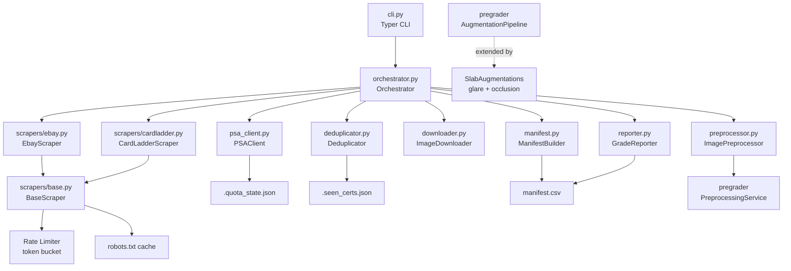

# Design Document: Training Data Pipeline

## Overview

The Training Data Pipeline is a standalone async module (`TCG-pregrader/data_pipeline/`)
that automates collection, verification, and organization of labeled PSA slab photos for
training the TCG Pre-Grader CNN.

**Core data flow:**

```
eBay Scraper ──┐
               ├──► Deduplicator ──► PSA Client ──► Manifest Builder ──► manifest.csv
CardLadder ────┘         │                │
Scraper                  │                └──► Image Downloader ──► disk
                         └──► .seen_certs.json
```

**Key design decisions and trade-offs:**

- Async-first (httpx + asyncio): all I/O is non-blocking. The scrapers, downloader, and
  PSA client all use `async/await`. The orchestrator fans out scraper tasks concurrently
  but serializes PSA API calls through a shared quota-aware client to avoid exhausting
  the 100-call daily limit.
- Standalone package: `data_pipeline/` is a separate installable package registered as
  `data-pipeline` in `pyproject.toml`. It imports from `pregrader` (for
  `PreprocessingService`, `ManifestRow`, `AugmentationPipeline`) but `pregrader` has no
  dependency on `data_pipeline`. This one-way dependency keeps the serving layer clean.
- State files over a database: quota state and seen-cert deduplication use JSON files.
  This is intentional for an offline batch pipeline — no infrastructure dependency, easy
  to inspect and reset manually. **Technical Debt**: at >10k certs/day, replace
  `.seen_certs.json` with SQLite for O(1) lookups instead of full-file deserialize.

## Architecture

### Module Structure

```
TCG-pregrader/
  data_pipeline/
    __init__.py
    config.py           # PipelineSettings (Pydantic BaseSettings)
    exceptions.py       # QuotaExhaustedError, CertLookupError, InvalidImageError, DownloadError
    psa_client.py       # PSA API wrapper — quota tracking + retry
    scrapers/
      __init__.py
      base.py           # BaseScraper ABC — robots.txt + rate limiter wiring
      ebay.py           # eBay sold listings scraper
      cardladder.py     # Card Ladder scraper
    downloader.py       # ImageDownloader — fetch, validate, save
    preprocessor.py     # ImagePreprocessor — quality filtering + label masking
    deduplicator.py     # Deduplicator — cert set + JSON persistence
    manifest.py         # ManifestBuilder — append-only CSV writer
    reporter.py         # GradeReporter — per-grade counts from CSV
    orchestrator.py     # top-level async coordinator
    cli.py              # Typer CLI entry point
```

### Component Interaction Diagram



### Async Concurrency Model

The orchestrator uses `asyncio.TaskGroup` (Python 3.11+) to run both scrapers
concurrently. Within each scraper, listing pages are fetched concurrently up to a
configurable `max_concurrent_requests` semaphore. PSA API calls are serialized through
the shared `PSAClient` which enforces the daily quota atomically.

```
asyncio.TaskGroup
  ├── Task: EbayScraper.scrape(grades=[1..10])
  │     └── asyncio.Semaphore(max_concurrent=5)
  │           ├── fetch page 1
  │           ├── fetch page 2
  │           └── ...
  └── Task: CardLadderScraper.scrape(grades=[1..10])
        └── asyncio.Semaphore(max_concurrent=3)
              ├── fetch grade 1 records
              └── ...

PSAClient (shared, quota-serialized via asyncio.Lock)
  └── called by both scrapers after dedup check
```

**Why serialize PSA calls?** The 100-call daily quota is a hard external constraint.
Using an `asyncio.Lock` around the quota check + increment ensures no two concurrent
scraper tasks can both see `calls_today < 100` and both proceed — a classic TOCTOU race.

## Components and Interfaces

### config.py — PipelineSettings

```python
from pydantic import Field, SecretStr
from pydantic_settings import BaseSettings, SettingsConfigDict

class PipelineSettings(BaseSettings):
    model_config = SettingsConfigDict(env_file=".env", extra="ignore")

    # --- Secrets (never logged) ---
    psa_api_token: SecretStr = Field(..., description="PSA Public API bearer token")

    # --- PSA Client ---
    psa_daily_quota: int = Field(default=100, ge=1)
    psa_quota_state_path: Path = Field(default=Path("data_pipeline/.quota_state.json"))
    psa_base_url: str = Field(default="https://api.psacard.com/publicapi/cert")

    # --- Deduplicator ---
    seen_certs_path: Path = Field(default=Path("data_pipeline/.seen_certs.json"))

    # --- Scrapers ---
    ebay_crawl_delay_seconds: float = Field(default=2.0, ge=2.0)
    cardladder_crawl_delay_seconds: float = Field(default=3.0, ge=3.0)
    max_listings_per_grade: int = Field(default=500, ge=1)
    max_records_per_grade: int = Field(default=500, ge=1)
    max_concurrent_requests: int = Field(default=5, ge=1)

    # --- Image quality thresholds ---
    min_sharpness: float = Field(default=50.0, ge=0.0)
    min_luminance: float = Field(default=30.0, ge=0.0, le=255.0)
    max_luminance: float = Field(default=230.0, ge=0.0, le=255.0)
    max_angle_degrees: float = Field(default=15.0, ge=0.0, le=90.0)

    # --- Augmentation ---
    glare_probability: float = Field(default=0.3, ge=0.0, le=1.0)
    label_occlusion_probability: float = Field(default=0.5, ge=0.0, le=1.0)

    # --- Output ---
    output_dir: Path = Field(default=Path("data/raw_slabs/"))
    manifest_path: Path = Field(default=Path("data/manifest.csv"))
    input_width: int = Field(default=224, ge=1)
    input_height: int = Field(default=312, ge=1)
    label_region_fraction: float = Field(default=0.15, ge=0.0, le=0.5)
```

**Why `SecretStr` for `psa_api_token`?** Pydantic's `SecretStr` redacts the value in
`__repr__`, `__str__`, and `model_dump()` by default — satisfying Requirement 9.4 at the
type level rather than relying on developer discipline.

---

### exceptions.py

```python
class PipelineError(Exception): ...          # base

class QuotaExhaustedError(PipelineError): ...
class CertLookupError(PipelineError):
    def __init__(self, cert_number: str, status_code: int): ...
class InvalidImageError(PipelineError): ...
class DownloadError(PipelineError): ...
class ConfigurationError(PipelineError): ...
```

These mirror the existing `pregrader.exceptions` hierarchy pattern — domain-specific
exceptions that map cleanly to log fields and CLI exit codes.

---

### psa_client.py — PSAClient

**Pattern**: Async HTTP client with quota guard + token bucket rate limiter.

```python
class QuotaState(BaseModel):
    calls_today: int = 0
    reset_at: datetime

class PSAClient:
    def __init__(self, settings: PipelineSettings) -> None: ...

    async def get_cert(self, cert_number: str) -> CertRecord:
        """
        Quota check (atomic via asyncio.Lock) → rate limiter token →
        httpx GET with exponential backoff retry → parse response → return CertRecord.
        Raises: QuotaExhaustedError, CertLookupError
        """

    async def _load_quota_state(self) -> QuotaState: ...
    async def _persist_quota_state(self, state: QuotaState) -> None: ...
    async def _retry_with_backoff(
        self,
        fn: Callable[[], Awaitable[httpx.Response]],
        max_retries: int = 3,
        base_delay: float = 2.0,
    ) -> httpx.Response: ...
```

**Quota persistence format** (`.quota_state.json`):
```json
{"calls_today": 47, "reset_at": "2025-01-15T00:00:00+00:00"}
```

Reset logic: on each `get_cert` call, if `now() >= reset_at`, zero the counter and set
`reset_at = now() + 24h` before proceeding.

**Retry logic**: 5xx and connection errors → retry up to 3 times with delays of 2s, 4s,
8s. HTTP 429 → read `Retry-After` header, sleep that duration, then retry (counts as one
of the 3 retries). 4xx (excluding 429) → raise `CertLookupError` immediately.

---

### scrapers/base.py — BaseScraper

**Pattern**: Template Method — subclasses implement `_parse_listings()` and
`_extract_cert_number()`, base class handles robots.txt, rate limiting, and crawl delay.

```python
class BaseScraper(ABC):
    def __init__(
        self,
        settings: PipelineSettings,
        psa_client: PSAClient,
        deduplicator: Deduplicator,
        downloader: ImageDownloader,
    ) -> None: ...

    async def scrape(self, grades: list[int]) -> list[ScrapedRecord]:
        """Fan out across grades, respecting crawl delay and robots.txt."""

    @abstractmethod
    async def _fetch_listings(
        self, grade: int, page: int
    ) -> list[RawListing]: ...

    @abstractmethod
    def _extract_cert_number(self, listing: RawListing) -> str | None: ...

    async def _check_robots(self, url: str) -> bool:
        """Returns True if the URL is allowed by robots.txt. Cached per domain."""

    async def _acquire_crawl_token(self) -> None:
        """Block until crawl delay has elapsed since last request to this host."""
```

---

### scrapers/ebay.py — EbayScraper

```python
CERT_PATTERN = re.compile(r"(?:PSA|cert)[^\d]*(\d{7,10})", re.IGNORECASE)

class EbayScraper(BaseScraper):
    BASE_URL = "https://www.ebay.com/sch/i.html"

    async def _fetch_listings(self, grade: int, page: int) -> list[RawListing]:
        """
        GET eBay completed listings search for "PSA {grade} pokemon".
        Parse HTML with BeautifulSoup4, extract listing title + image URL.
        """

    def _extract_cert_number(self, listing: RawListing) -> str | None:
        """Apply CERT_PATTERN to listing title + description."""
```

**eBay search URL pattern:**
`https://www.ebay.com/sch/i.html?_nkw=PSA+{grade}+pokemon&LH_Complete=1&LH_Sold=1&_pgn={page}`

---

### scrapers/cardladder.py — CardLadderScraper

```python
class CardLadderScraper(BaseScraper):
    BASE_URL = "https://www.cardladder.com"

    async def _fetch_listings(self, grade: int, page: int) -> list[RawListing]:
        """
        GET Card Ladder sales history filtered by PSA grade.
        Parse HTML with BeautifulSoup4, extract sale record + image URL.
        """

    def _extract_cert_number(self, listing: RawListing) -> str | None:
        """
        Extract cert from Card Ladder record metadata.
        Returns None if not present — caller sets verified=False.
        """
```

---

### downloader.py — ImageDownloader

```python
class ImageDownloader:
    VALID_MAGIC: dict[bytes, str] = {
        b"\xff\xd8\xff": "jpg",
        b"\x89PNG": "png",
    }

    async def download(
        self,
        url: str,
        cert_number: str,
        output_dir: Path,
    ) -> Path:
        """
        Skip if {cert_number}.jpg already exists.
        Fetch with retry/backoff (max 3 attempts).
        Validate magic bytes → InvalidImageError if not JPEG/PNG.
        Write to {output_dir}/{cert_number}.{ext}.
        Returns the saved path.
        """
```

**Why magic bytes over Content-Type?** Content-Type is server-supplied and unreliable
for scraped content. Magic bytes are read from the actual downloaded payload.

---

### preprocessor.py — ImagePreprocessor

**Pattern**: Strategy — quality filters are applied as a chain; any rejection short-
circuits the chain and returns `None` with a logged reason.

```python
@dataclass
class QualityReport:
    sharpness: float
    mean_luminance: float
    detected_angle: float
    rejected: bool
    rejection_reason: str | None

class ImagePreprocessor:
    def __init__(self, settings: PipelineSettings) -> None: ...

    def filter_quality(
        self,
        image_bytes: bytes,
        cert_number: str,
    ) -> tuple[np.ndarray | None, QualityReport]:
        """
        1. Decode bytes → numpy array
        2. Laplacian variance → sharpness score
        3. PIL mean luminance check
        4. OpenCV contour → angle detection → PreprocessingService.correct() if needed
        Returns (array, report). array is None if rejected.
        """

    def mask_label_region(
        self,
        image: np.ndarray,
        cert_number: str,
        target_size: tuple[int, int],
    ) -> np.ndarray:
        """
        Crop bottom label_region_fraction of image.
        Raises InvalidImageError if height < 100px.
        Resize to target_size (preserving aspect ratio via letterbox).
        Logs cert_number and pixel rows removed.
        """
```

**Sharpness**: `cv2.Laplacian(gray, cv2.CV_64F).var()` — higher = sharper.
**Luminance**: `np.array(PIL.Image.open(...).convert('L')).mean()`.
**Angle**: largest contour bounding rect → `cv2.minAreaRect` → angle from vertical.

---

### deduplicator.py — Deduplicator

```python
class Deduplicator:
    def __init__(self, state_path: Path) -> None:
        self._seen: set[str] = set()
        self._state_path = state_path

    def load(self) -> None:
        """Load persisted set from JSON if file exists."""

    def is_seen(self, cert_number: str) -> bool: ...

    def mark_seen(self, cert_number: str, source: str) -> None:
        """Add to in-memory set. Logs DEBUG if already present."""

    def persist(self) -> None:
        """Atomically write seen set to JSON state file."""
```

**Atomic write pattern**: write to `.seen_certs.json.tmp`, then `os.replace()` — avoids
a corrupt state file if the process is killed mid-write.

---

### manifest.py — ManifestBuilder

```python
class ManifestBuilder:
    HEADER = ["image_path", "overall_grade", "centering", "corners", "edges", "surface"]

    def __init__(self, manifest_path: Path, project_root: Path) -> None: ...

    def append_row(self, cert_record: CertRecord, image_path: Path) -> None:
        """
        Validate via ManifestRow (raises ValidationError on bad grades).
        Convert image_path to relative from project_root.
        Append CSV row. Creates file with header if it doesn't exist.
        """
```

**Why reuse `ManifestRow` from `pregrader.schemas`?** The existing `ManifestLoader`
already validates against `ManifestRow` at training time. Validating at write time with
the same schema means the manifest is always in a state that `ManifestLoader` can consume
without errors — the pipeline and the trainer share a single source of truth.

---

### reporter.py — GradeReporter

```python
class GradeReporter:
    TARGET_PER_GRADE = 500
    WARNING_THRESHOLD = 100

    def report(
        self,
        manifest_path: Path,
        rejection_counts: dict[str, int],
    ) -> GradeReport:
        """
        Read manifest CSV, count rows per overall_grade.
        Print table to stdout.
        Log WARNING for grades < 100, INFO for grades >= 500.
        Include rejection_counts breakdown in output.
        """
```

**Why read from CSV rather than in-memory state?** Requirement 7.4 is explicit: the
report must reflect the true persisted dataset. In-memory counts would be wrong if a
previous run's rows are already in the manifest.

---

### orchestrator.py — Orchestrator

```python
class Orchestrator:
    def __init__(self, settings: PipelineSettings) -> None:
        # Wire up all components with shared settings
        self._psa_client = PSAClient(settings)
        self._deduplicator = Deduplicator(settings.seen_certs_path)
        self._downloader = ImageDownloader(settings)
        self._preprocessor = ImagePreprocessor(settings)
        self._manifest = ManifestBuilder(settings.manifest_path, project_root)
        self._reporter = GradeReporter()

    async def run(
        self,
        grades: list[int],
        max_per_grade: int,
    ) -> GradeReport:
        """
        1. Load deduplicator state
        2. async TaskGroup: run EbayScraper + CardLadderScraper concurrently
        3. For each scraped record (post-dedup):
           a. Call PSAClient.get_cert()
           b. Download image
           c. Filter quality
           d. ManifestBuilder.append_row()
        4. Persist deduplicator state
        5. Run GradeReporter
        6. Return GradeReport
        """
```

### cli.py — Typer CLI

```python
app = typer.Typer()

@app.command()
def run(
    grades: list[int] = typer.Option(list(range(1, 11)), help="PSA grades to collect"),
    max_per_grade: int = typer.Option(500, help="Max images per grade"),
    output_dir: Path = typer.Option(Path("data/raw_slabs/")),
    manifest_path: Path = typer.Option(Path("data/manifest.csv")),
) -> None:
    """Run the training data collection pipeline."""
    settings = load_settings().model_copy(
        update={"output_dir": output_dir, "manifest_path": manifest_path}
    )
    asyncio.run(Orchestrator(settings).run(grades=grades, max_per_grade=max_per_grade))
```

Registered in `pyproject.toml`:
```toml
[project.scripts]
pregrader = "pregrader.cli:app"
data-pipeline = "data_pipeline.cli:app"
```

---

### Augmentation Extension — SlabAugmentations

The existing `AugmentationPipeline` in `src/pregrader/training/augmentation.py` is
extended by adding two new TF ops. The extension follows the existing pattern: new
transforms are added to `apply()` after the existing geometric transforms, before any
normalization step.

```python
# In augmentation.py — additions to AugmentationPipeline

def __init__(
    self,
    glare_probability: float = 0.3,
    label_occlusion_probability: float = 0.5,
) -> None:
    # existing rotation layer init ...
    self._glare_prob = glare_probability
    self._label_occlusion_prob = label_occlusion_probability

def apply(self, image_tensor: tf.Tensor, training: bool = True) -> tf.Tensor:
    """
    Existing: flip → brightness → rotation
    New (training only): → glare simulation → label occlusion
    """
    image = # ... existing transforms ...

    if training:
        image = self._apply_glare(image)
        image = self._apply_label_occlusion(image)

    return tf.clip_by_value(image, 0.0, 1.0)

def _apply_glare(self, image: tf.Tensor) -> tf.Tensor:
    """
    With probability glare_probability:
      - Sample random (x, y) in upper 85% of image
      - Sample random ellipse axes and intensity in [0.3, 0.7]
      - Overlay semi-transparent white ellipse using tf.tensor_scatter_nd_update
    """

def _apply_label_occlusion(self, image: tf.Tensor) -> tf.Tensor:
    """
    With probability label_occlusion_probability:
      - Compute bottom 15% pixel rows
      - Replace with tf.ones * mean_color (solid fill)
    """
```

**Why extend `AugmentationPipeline` rather than subclass?** The existing
`DatasetBuilder` and `TrainingLoop` hold a reference to `AugmentationPipeline` directly.
Subclassing would require changing those call sites. Adding the new transforms as
optional parameters with defaults of 0.0 means existing tests pass unchanged — the new
behavior is opt-in via `PipelineSettings`.

**Why `training: bool = True` parameter?** Requirement 12.5 mandates slab augmentations
are skipped for validation. Adding a `training` flag to `apply()` is the standard Keras
pattern (mirrors `tf.keras.layers.Layer.__call__(training=...)`) and avoids needing a
separate validation pipeline.

**Technical Debt**: `tf.tensor_scatter_nd_update` for the glare ellipse is verbose and
slow compared to a numpy-based approach. Since augmentation runs inside
`tf.data.Dataset.map()` in graph mode, we're constrained to TF ops. At scale, consider
`keras_cv.layers` which has native glare/cutout augmentation layers.

## Data Models

### CertRecord

```python
class CertRecord(BaseModel):
    """Validated label data from the PSA Public API."""
    model_config = ConfigDict(frozen=True)

    cert_number: str
    overall_grade: int = Field(ge=1, le=10)
    centering: float = Field(ge=1.0, le=10.0)
    corners: float = Field(ge=1.0, le=10.0)
    edges: float = Field(ge=1.0, le=10.0)
    surface: float = Field(ge=1.0, le=10.0)
    verified: bool = True  # False when grade sourced from listing, not PSA API
```

### RawListing

```python
class RawListing(BaseModel):
    """Intermediate scraper output before cert lookup."""
    source: Literal["ebay", "cardladder"]
    listing_url: str
    image_url: str
    title: str
    raw_grade: int | None = None  # grade from listing metadata, pre-PSA-verification
    cert_number: str | None = None
```

### ScrapedRecord

```python
class ScrapedRecord(BaseModel):
    """Post-dedup, post-PSA-lookup record ready for download + manifest write."""
    cert_record: CertRecord
    image_url: str
    source: Literal["ebay", "cardladder"]
```

### GradeReport

```python
class GradeReport(BaseModel):
    """Output of GradeReporter.report()."""
    counts_per_grade: dict[int, int]          # grade → image count
    rejection_counts: dict[str, int]          # filter_name → rejected count
    grades_below_warning: list[int]           # grades with count < 100
    grades_at_target: list[int]               # grades with count >= 500
    total_images: int
```

### QuotaState

```python
class QuotaState(BaseModel):
    calls_today: int = 0
    reset_at: datetime
```

### Manifest CSV Schema

Reuses the existing `ManifestRow` from `pregrader.schemas`:

| Column | Type | Constraint |
|---|---|---|
| `image_path` | `Path` | relative from project root |
| `overall_grade` | `int` | [1, 10] |
| `centering` | `float` | [1.0, 10.0] |
| `corners` | `float` | [1.0, 10.0] |
| `edges` | `float` | [1.0, 10.0] |
| `surface` | `float` | [1.0, 10.0] |

### State Files

**`.quota_state.json`** (persisted by `PSAClient`):
```json
{"calls_today": 47, "reset_at": "2025-01-15T00:00:00+00:00"}
```

**`.seen_certs.json`** (persisted by `Deduplicator`):
```json
{"seen": ["12345678", "87654321", "11223344"]}
```

## Correctness Properties

*A property is a characteristic or behavior that should hold true across all valid
executions of a system — essentially, a formal statement about what the system should do.
Properties serve as the bridge between human-readable specifications and
machine-verifiable correctness guarantees.*

---

### Property 1: Deduplication invariant

*For any* sequence of cert numbers from any combination of sources (including duplicates
within and across sources), after processing through the `Deduplicator`, each unique cert
number appears exactly once in the in-memory seen set and exactly once in the persisted
`.seen_certs.json` state file.

**Validates: Requirements 5.1, 5.2, 5.3**

---

### Property 2: Manifest schema validity

*For any* `CertRecord` and image path written by `ManifestBuilder`, every row in the
output manifest CSV passes `ManifestRow` Pydantic validation — meaning `overall_grade`
is in [1, 10] and all subgrade floats are in [1.0, 10.0]. No row that fails validation
should appear in the manifest.

**Validates: Requirements 6.1, 6.2, 6.3**

---

### Property 3: Manifest append invariant

*For any* existing manifest CSV with N valid rows and a new batch of M valid records,
after `ManifestBuilder.append_row()` is called M times, the manifest contains exactly
N + M rows (original rows are preserved, no rows are lost or duplicated).

**Validates: Requirements 6.4**

---

### Property 4: Quality filter monotonicity

*For any* image and any quality threshold (sharpness, min_luminance, max_luminance,
max_angle_degrees), relaxing a threshold (lowering `min_sharpness`, lowering
`min_luminance`, raising `max_luminance`, raising `max_angle_degrees`) never causes a
previously accepted image to be rejected. Formally: if image I passes filter F with
threshold T, it must also pass F with any threshold T' that is strictly more permissive
than T.

**Validates: Requirements 13.1, 13.2, 13.3, 13.5**

---

### Property 5: Grade reporter accuracy

*For any* manifest CSV, the counts returned by `GradeReporter.report()` for each grade
exactly match the number of rows in the CSV with that `overall_grade` value. The reporter
must derive counts by reading the CSV, not from any in-memory accumulator.

**Validates: Requirements 7.1, 7.4**

---

### Property 6: PSA quota enforcement

*For any* sequence of `PSAClient.get_cert()` calls within a single 24-hour window, the
total number of successful HTTP requests made to the PSA API never exceeds
`psa_daily_quota` (default 100). Once the quota is exhausted, all subsequent calls raise
`QuotaExhaustedError` without making an HTTP request.

**Validates: Requirements 1.3, 1.4**

---

### Property 7: Retry count bound

*For any* transient HTTP error (5xx or connection timeout) returned by an external
service (PSA API or image host), the total number of HTTP attempts made by the client
is at most `max_retries + 1` (default: 4). The client never retries indefinitely.

**Validates: Requirements 1.5, 4.4**

---

### Property 8: Cert number extraction completeness

*For any* HTML string containing one or more PSA cert numbers in the expected format
(7–10 digit numeric string preceded by "PSA" or "cert", case-insensitive), the scraper's
`_extract_cert_number()` method returns a non-None value matching the embedded cert
number.

**Validates: Requirements 2.2, 3.2**

---

### Property 9: Max-per-grade bound

*For any* configured `max_listings_per_grade` value N and any grade G, the scraper
processes at most N listings for grade G in a single run, regardless of how many listings
are available in the source.

**Validates: Requirements 2.7, 3.7**

---

### Property 10: Label masking correctness

*For any* validation image with height H >= 100 pixels, after `mask_label_region()`:
(a) the intermediate cropped image has height `floor(H * (1 - label_region_fraction))`,
(b) the final output has dimensions matching `(input_height, input_width)`, and
(c) the same image processed as a training image (masking not applied) has its full
pixel content preserved.

**Validates: Requirements 11.1, 11.2, 11.3**

---

### Property 11: Label occlusion determinism

*For any* training image and `label_occlusion_probability = 1.0`, the bottom
`label_region_fraction` of the augmented output tensor contains uniform pixel values
(solid fill), confirming the occlusion was applied. For `label_occlusion_probability =
0.0`, the output tensor is identical to the input tensor in the bottom region.

**Validates: Requirements 12.2, 12.5**

---

### Property 12: Secret redaction

*For any* `PipelineSettings` instance with a non-empty `psa_api_token`, the string
representations `str(settings)`, `repr(settings)`, and `settings.model_dump()` do not
contain the raw token value — only the `SecretStr` placeholder `'**********'`.

**Validates: Requirements 9.4**

## Error Handling

### Error Taxonomy

| Exception | Raised by | Behavior |
|---|---|---|
| `QuotaExhaustedError` | `PSAClient` | Orchestrator catches, logs ERROR, halts PSA calls for the run |
| `CertLookupError` | `PSAClient` | Orchestrator catches per-cert, logs WARNING, skips that cert |
| `InvalidImageError` | `ImageDownloader`, `ImagePreprocessor` | Orchestrator catches per-image, logs WARNING, skips |
| `DownloadError` | `ImageDownloader` | Orchestrator catches per-image, logs WARNING, skips |
| `ConfigurationError` | `load_settings()` | CLI catches at startup, prints message, exits with code 1 |
| `ValidationError` (Pydantic) | `ManifestBuilder` | Caught per-row, logs ERROR with cert number + field, skips row |

### Retry Matrix

| Scenario | Retries | Backoff |
|---|---|---|
| PSA API 5xx | 3 | 2s, 4s, 8s |
| PSA API 429 | 3 | `Retry-After` header value |
| PSA API 4xx (not 429) | 0 | raise `CertLookupError` immediately |
| Image download failure | 3 | 1s, 2s, 4s |
| robots.txt fetch failure | 0 | log WARNING, assume allowed (fail-open) |

**Why fail-open on robots.txt?** A robots.txt fetch failure is likely a transient network
issue. Halting the entire pipeline because we couldn't fetch a policy file is too
aggressive. We log the failure so the operator can investigate, but we don't block
collection. **Technical Debt**: add a `--strict-robots` CLI flag that fails-closed for
production use.

### Graceful Degradation

The orchestrator is designed so that a failure in one cert/image never stops the pipeline:

```
for each scraped record:
    try:
        cert = await psa_client.get_cert(cert_number)
        path = await downloader.download(image_url, cert_number)
        filtered, report = preprocessor.filter_quality(path, cert_number)
        if filtered is not None:
            manifest.append_row(cert, path)
    except QuotaExhaustedError:
        logger.error("quota_exhausted"); break  # stop PSA calls, finish downloads
    except (CertLookupError, InvalidImageError, DownloadError) as e:
        logger.warning("record_skipped", cert=cert_number, reason=str(e))
        continue
```

## Testing Strategy

### Dual Testing Approach

Both unit tests and property-based tests are required. They are complementary:
- Unit tests catch concrete bugs in specific scenarios (e.g., "does the CSV header match
  exactly?", "does a 429 response read the Retry-After header?")
- Property tests verify universal invariants across thousands of generated inputs (e.g.,
  "does deduplication hold for any sequence of cert numbers?")

### Property-Based Testing

**Library**: `hypothesis` (already in `dev` dependencies in `pyproject.toml`).
**Minimum iterations**: 100 per property (Hypothesis default; increase via
`@settings(max_examples=500)` for CI).

Each property test maps directly to a Correctness Property above:

```python
# Feature: training-data-pipeline, Property 1: Deduplication invariant
@given(st.lists(st.text(min_size=7, max_size=10, alphabet=st.characters(whitelist_categories=("Nd",)))))
@settings(max_examples=200)
def test_deduplication_invariant(cert_numbers: list[str]) -> None:
    dedup = Deduplicator(state_path=tmp_path / ".seen_certs.json")
    for cert in cert_numbers:
        dedup.mark_seen(cert, source="ebay")
    dedup.persist()
    dedup2 = Deduplicator(state_path=tmp_path / ".seen_certs.json")
    dedup2.load()
    assert dedup2._seen == set(cert_numbers)  # each unique cert exactly once

# Feature: training-data-pipeline, Property 2: Manifest schema validity
@given(st.builds(CertRecord, overall_grade=st.integers(min_value=1, max_value=10), ...))
def test_manifest_rows_always_valid(cert_record: CertRecord, image_path: Path) -> None:
    builder = ManifestBuilder(manifest_path, project_root)
    builder.append_row(cert_record, image_path)
    rows = ManifestLoader().load(manifest_path)
    assert all(isinstance(r, ManifestRow) for r in rows)

# Feature: training-data-pipeline, Property 4: Quality filter monotonicity
@given(
    image=numpy_arrays(dtype=np.uint8, shape=(312, 224, 3)),
    threshold=st.floats(min_value=0.0, max_value=200.0),
    delta=st.floats(min_value=0.0, max_value=50.0),
)
def test_quality_filter_monotonicity(image, threshold, delta) -> None:
    preprocessor_strict = ImagePreprocessor(settings_with(min_sharpness=threshold + delta))
    preprocessor_relaxed = ImagePreprocessor(settings_with(min_sharpness=threshold))
    _, report_strict = preprocessor_strict.filter_quality(image, "test")
    _, report_relaxed = preprocessor_relaxed.filter_quality(image, "test")
    # If strict accepts, relaxed must also accept
    if not report_strict.rejected:
        assert not report_relaxed.rejected

# Feature: training-data-pipeline, Property 5: Grade reporter accuracy
@given(st.lists(st.integers(min_value=1, max_value=10), min_size=0, max_size=1000))
def test_reporter_counts_match_csv(grades: list[int]) -> None:
    # Write a manifest with known grades, verify reporter counts match
    write_manifest(grades, manifest_path)
    report = GradeReporter().report(manifest_path, rejection_counts={})
    for grade in range(1, 11):
        assert report.counts_per_grade.get(grade, 0) == grades.count(grade)
```

### Unit Tests

Focus on specific examples, integration points, and edge cases:

| Test | What it covers |
|---|---|
| `test_psa_client_missing_token` | `ConfigurationError` raised when `PSA_API_TOKEN` absent |
| `test_psa_client_429_reads_retry_after` | 429 response → reads `Retry-After` header |
| `test_psa_client_4xx_raises_cert_lookup_error` | 4xx (not 429) → `CertLookupError` |
| `test_downloader_skips_existing_file` | idempotent download — file already on disk |
| `test_downloader_invalid_magic_bytes` | random bytes → `InvalidImageError` |
| `test_manifest_builder_creates_header` | new manifest file has correct CSV header |
| `test_manifest_builder_relative_paths` | absolute path → relative in CSV |
| `test_preprocessor_rejects_tiny_image` | height < 100px → `InvalidImageError` |
| `test_robots_txt_disallowed_path_skipped` | disallowed URL → not requested |
| `test_robots_txt_cached_not_refetched` | robots.txt fetched once per domain per run |
| `test_augmentation_training_flag_false` | `apply(image, training=False)` → no slab augmentations |
| `test_augmentation_occlusion_probability_1` | `label_occlusion_probability=1.0` → bottom 15% is uniform |
| `test_cli_default_grades` | `data-pipeline run` with no `--grades` → grades 1–10 |
| `test_cli_default_max_per_grade` | `data-pipeline run` with no `--max-per-grade` → 500 |

### Test File Layout

```
TCG-pregrader/tests/
  unit/
    data_pipeline/
      test_psa_client.py
      test_deduplicator.py
      test_manifest_builder.py
      test_image_downloader.py
      test_image_preprocessor.py
      test_grade_reporter.py
      test_scrapers.py
      test_augmentation_slab.py
      test_cli.py
  property/
    data_pipeline/
      test_prop_deduplication.py      # Property 1
      test_prop_manifest_validity.py  # Properties 2, 3
      test_prop_quality_filter.py     # Property 4
      test_prop_reporter.py           # Property 5
      test_prop_quota.py              # Property 6
      test_prop_retry.py              # Property 7
      test_prop_cert_extraction.py    # Property 8
      test_prop_label_masking.py      # Property 10
      test_prop_augmentation.py       # Property 11
      test_prop_secret_redaction.py   # Property 12
```

**Property test configuration** in `pyproject.toml`:
```toml
[tool.pytest.ini_options]
# Hypothesis CI profile — increase max_examples in CI via env var
# HYPOTHESIS_PROFILE=ci pytest
```

```python
# conftest.py
from hypothesis import settings, HealthCheck
settings.register_profile("ci", max_examples=500, suppress_health_check=[HealthCheck.too_slow])
settings.register_profile("dev", max_examples=100)
settings.load_profile(os.getenv("HYPOTHESIS_PROFILE", "dev"))
```
